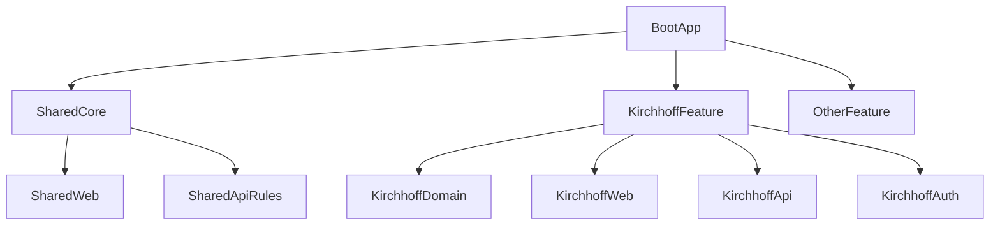

# Merge Architecture For Unified Physics App

## Target Shape

Рекомендуемая цель для объединения нескольких похожих проектов: один Spring Boot application в формате modular monolith, где каждый симулятор живёт как отдельная feature-зона.

Это лучше, чем прямое слияние всех классов в один flat module, потому что у текущего проекта есть собственные security assumptions, runtime storage и standalone app boundaries, которые будут конфликтовать с другими аналогичными приложениями, даже если разработчики уже привели имена файлов и адресов к общему стилю.

Ключевое правило: в итоговой системе должен быть только один общий `@SpringBootApplication`. У каждой feature-зоны своя бизнес-логика, свои DTO и свои адаптеры, но не свой application bootstrap.

Главный критерий архитектуры: новый проект должен добавляться максимально просто, по повторяемому шаблону, без изменения общесистемного кода там, где это можно избежать.
Дополнительное правило интеграции: переносить каждый проект в общий репозиторий в максимально исходном виде и не делать изменений "ради красоты", если можно встроить проект без них.

## Recommended Module Boundaries

### App Core

Общий слой приложения должен содержать:

- единый `@SpringBootApplication`;
- общую навигацию, layout и error handling;
- общую конфигурацию `application.properties`;
- только общий bootstrap и инфраструктурные соглашения.

### Shared

Общий переиспользуемый слой должен содержать:

- общие DTO и utility-классы;
- shared web fragments/layout;
- общие exception mappers;
- соглашения по маршрутам и resource namespacing.

Shared должен оставаться минимальным. Если вынести туда слишком много, добавление нового проекта станет сложнее, потому что каждый новый модуль начнёт требовать согласования с общей логикой.

### Feature Modules

Каждый симулятор должен жить в отдельной feature-зоне, например:

- `features/kirchhoff`
- `features/ohm`
- `features/optics`

Каждая feature-зона должна владеть:

- своей бизнес-логикой и DTO;
- своими UI controllers и REST controllers как адаптерами к этой логике;
- своей авторизацией и связанным с ней persistence, если это часть проекта;
- своими шаблонами;
- своими static assets;
- своими integration tests.

Каждая feature-зона не должна владеть:

- собственным `@SpringBootApplication`;
- глобальными application properties;
- общесистемным lifecycle/bootstrap.

Идеальная цель: чтобы добавление новой feature сводилось к копированию предсказуемой структуры и подключению её в одном-двух очевидных местах.



## How This Project Maps Into That Structure

## Simplicity-First Rule

При конфликте между "красивой общей абстракцией" и "простым добавлением нового проекта" приоритет должен быть у второго.

Практически это означает:

- не выносить в shared то, что используется только одной feature;
- не пытаться заранее унифицировать auth между проектами;
- не строить сложную иерархию модулей ради гипотетического переиспользования;
- сохранять одинаковую внутреннюю структуру каждой feature;
- сохранять исходную структуру и поведение переносимого проекта, меняя только то, что обязательно для интеграции в общее приложение.

## Recommended Feature Template

Чтобы новый проект добавлялся максимально просто, у каждой feature должна быть одна и та же форма:

```text
features/<project>/
  domain/
  auth/
  ui/
  api/
  templates/
  static/
  config/
  test/
```

Если новый проект укладывается в такой шаблон, его можно переносить почти механически, без переработки остального приложения.

### Move To Feature Module

Эти части логично перенести в `features/kirchhoff`:

- `src/main/java/com/example/isib/model/*`
- `src/main/java/com/example/isib/ui/KirchhoffSimulationController.java`
- `src/main/java/com/example/isib/api/KirchhoffSimulationRestController.java`
- `src/main/java/com/example/isib/api/KirchhoffSimulationResponse.java`
- `src/main/resources/templates/kirchhoff-main.html`
- `src/main/resources/templates/fragments/kirchhoff-*.html`
- `src/main/resources/static/css/kirchhoff-style.css`
- `src/main/resources/static/js/kirchhoff-script.js`
- `src/test/java/com/example/isib/model/KirchhoffCircuitModelTest.java`

Это и есть основная feature-область: собственная бизнес-логика Кирхгофа и её UI/API-обвязка.

### Keep Inside Feature Or Rebuild Per Feature

Эти части не нужно выносить в shared по умолчанию. Их нужно оставить внутри feature или пересобрать заново под правила общего приложения:

- `src/main/java/com/example/isib/KirchhoffSecurityConfiguration.java`
- `src/main/java/com/example/isib/auth/FileUserAccountService.java`
- `src/main/java/com/example/isib/auth/UserRegistrationForm.java`
- `src/main/java/com/example/isib/ui/KirchhoffLoginController.java`
- `src/main/resources/templates/kirchhoff-login.html`
- `src/main/resources/templates/kirchhoff-register.html`
Если у каждого проекта авторизация своя, эти классы должны жить в рамках feature-зоны, а не превращаться в общий auth layer.

### Do Not Carry Over As Standalone App Assumptions

Не переносить как feature-level ответственность:

- `src/main/java/com/example/isib/KirchhoffApplication.java`
- `server.port=8080`
- `server.servlet.context-path=/kirchhoff`
- `spring.application.name=KirchhoffPhysics`
- `app.security.users-file=data/kirchhoff-physics-project-users.txt`

## Merge Rules

### 1. Route Ownership

Предполагается, что разработчики уже поменяли адреса и URL-схему. Значит, задача следующего агента не переименовывать маршруты заново, а сохранить ownership границ:

- feature-модуль не должен требовать собственного глобального `context-path`;
- UI и API маршруты должны встраиваться в уже принятую схему адресов общего приложения;
- registration/login routes могут оставаться feature-specific, если это соответствует логике конкретного проекта.

### 2. Package Namespacing

Не оставлять код под общим `com.example.isib`. После переноса у feature должна быть явная зона, например:

```text
com.yourorg.physics.features.kirchhoff
```

Это резко снижает вероятность коллизий при переносе других похожих проектов.

### 3. Template And Static Asset Namespacing

Даже если файлы уже переименованы, не хранить feature templates и assets как глобальные ресурсы без дисциплины.

Рекомендуемый подход:

- templates: `templates/features/kirchhoff/...`
- fragments: `templates/features/kirchhoff/fragments/...`
- css/js: `static/features/kirchhoff/...`

Даже если имена файлов уже префиксованы, directory namespace всё равно нужен.

### 4. Feature-Owned Authorization

Авторизация у каждого проекта своя, поэтому:

- feature может иметь собственные login/register/logout flow;
- feature может иметь собственный storage пользователей;
- security wiring не должно маскироваться под shared-auth, если оно реально специфично для проекта;
- при этом нужно избегать случайного влияния auth-правил одной feature на маршруты другой.

### 5. Feature-Owned Storage

File-based users storage из текущего проекта подходит только как локальная standalone реализация.

Если у каждого проекта авторизация своя, storage тоже надо считать feature-specific до тех пор, пока не появится реальное общее решение.

### 6. Config Ownership

Глобальные настройки порта, app name, security storage и logging не должны принадлежать feature-модулю.

Feature может владеть только своими feature-specific properties, например:

```text
app.features.kirchhoff.defaults.*
app.features.kirchhoff.ui.*
```

## Recommended Migration Sequence For Multiple Projects

1. Выделить общий boot app и shared layer.
2. Перенести первый проект как `kirchhoff` feature и стабилизировать соглашения по packages/resources/integration boundaries.
3. Только после этого переносить второй и последующие симуляторы по той же схеме.
4. Общие части выделять в shared только после того, как одинаковый паттерн появился минимум в двух feature-модулях.
5. Для каждого следующего проекта использовать тот же feature template, не придумывая новую структуру.

## Adding A New Project Checklist

Чтобы добавить новый проект максимально просто, следующий агент должен делать только это:

1. создать новый feature package по стандартному шаблону;
2. перенести domain, auth, ui, api и resources внутрь этого feature;
3. убрать standalone bootstrap и standalone app properties;
4. проверить, что маршруты и ресурсы не пересекаются с уже существующими feature;
5. не менять shared слой без явной необходимости.

## Decision Rules For Future Agents

- если код зависит только от расчётов и DTO, переносить в feature-domain;
- если код зависит от login, users file и project-specific auth rules, переносить внутрь конкретной feature, а не в shared;
- если код зависит от standalone route assumptions или собственного application bootstrap, не копировать напрямую;
- если ресурс может столкнуться по имени с другим проектом, добавлять feature namespace;
- если свойство настраивает всё приложение, оно не должно жить в feature module.
- если для нового проекта нужно менять много shared-кода, архитектура стала слишком сложной и её нужно упрощать.

## Minimal End State

После первого корректного слияния этот проект должен существовать не как отдельный сервис, а как:

- feature package Кирхгофа;
- feature business module без собственного `@SpringBootApplication`;
- feature UI/API layer, встроенный в общую схему маршрутов;
- собственная auth-логика feature без вынесения в ложный shared слой;
- feature tests, не требующие собственного `server.servlet.context-path`;
- отсутствие file-based runtime storage внутри feature-кода по умолчанию.
